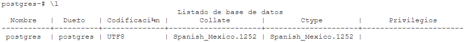
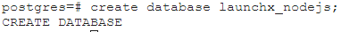
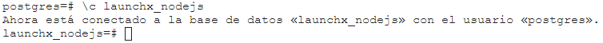
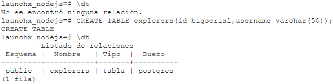
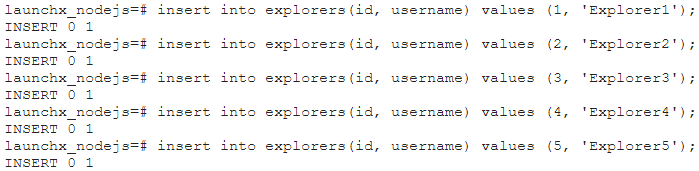
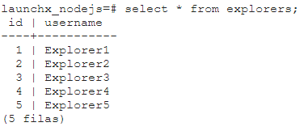
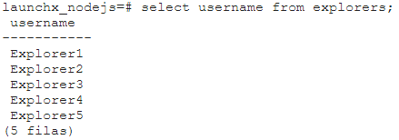
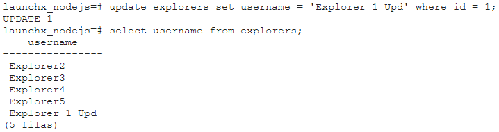
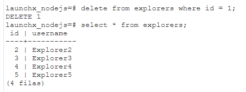

# Weekly Mission 5 - SQL_Postgresql

Con el comando **\l** se obtiene la lista de las bases de datos.

**CREATE DATABASE** se crea una nueva base de datos.

**\c** se selecciona la base de datos

**\dt** se obtine la información sobre las tablas.

**CREATE TABLE** para crear una nueva tabla definiendo el nombre y las columnas juento con el tipo de dato.

**insert into**  para agregar nueva información

**select * from explorers** para consultar toda la información que contiene la tabla.

**select username from explorers** selecciona una sola columna para mostrar la información contenida.

**UPDATE** para actualizar la información.

**Delete** elimina información.

